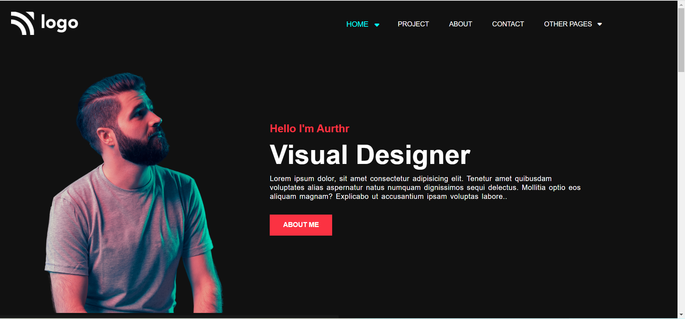
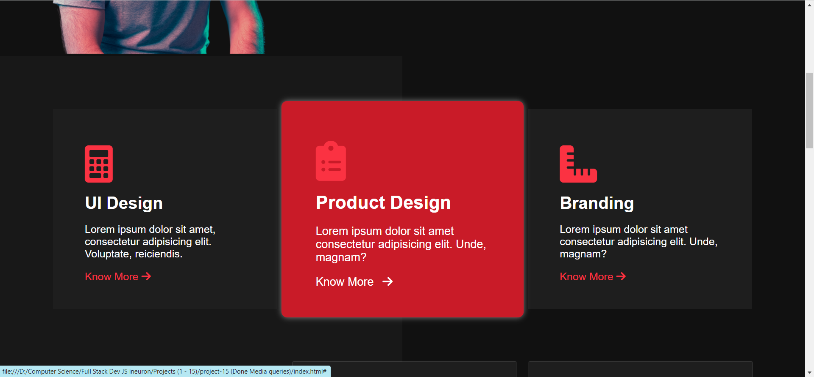
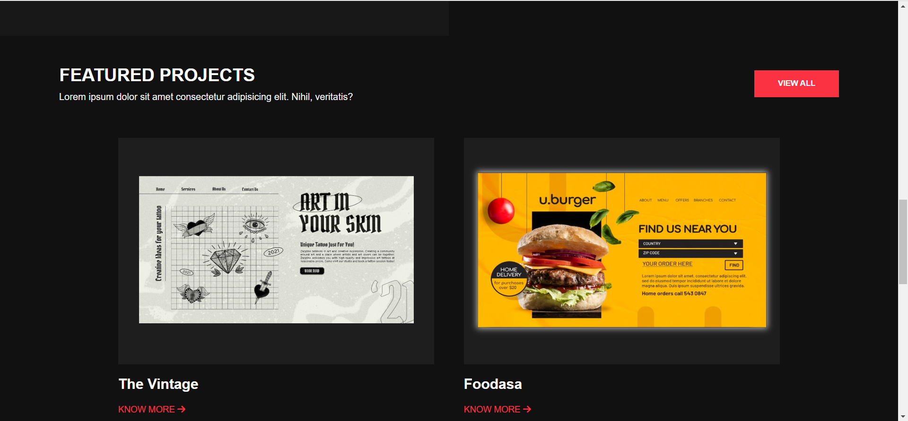
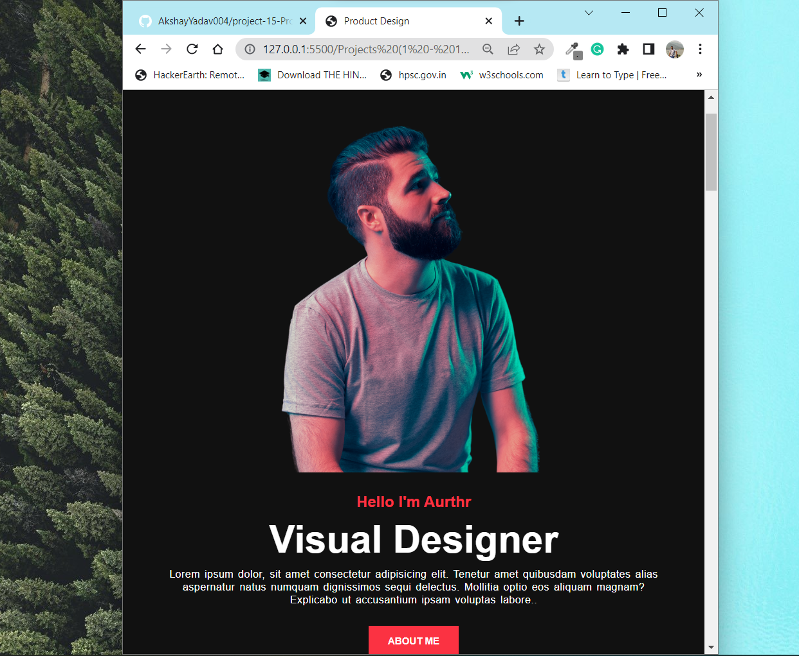
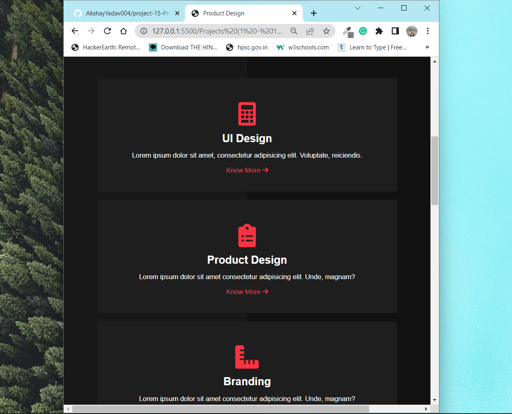
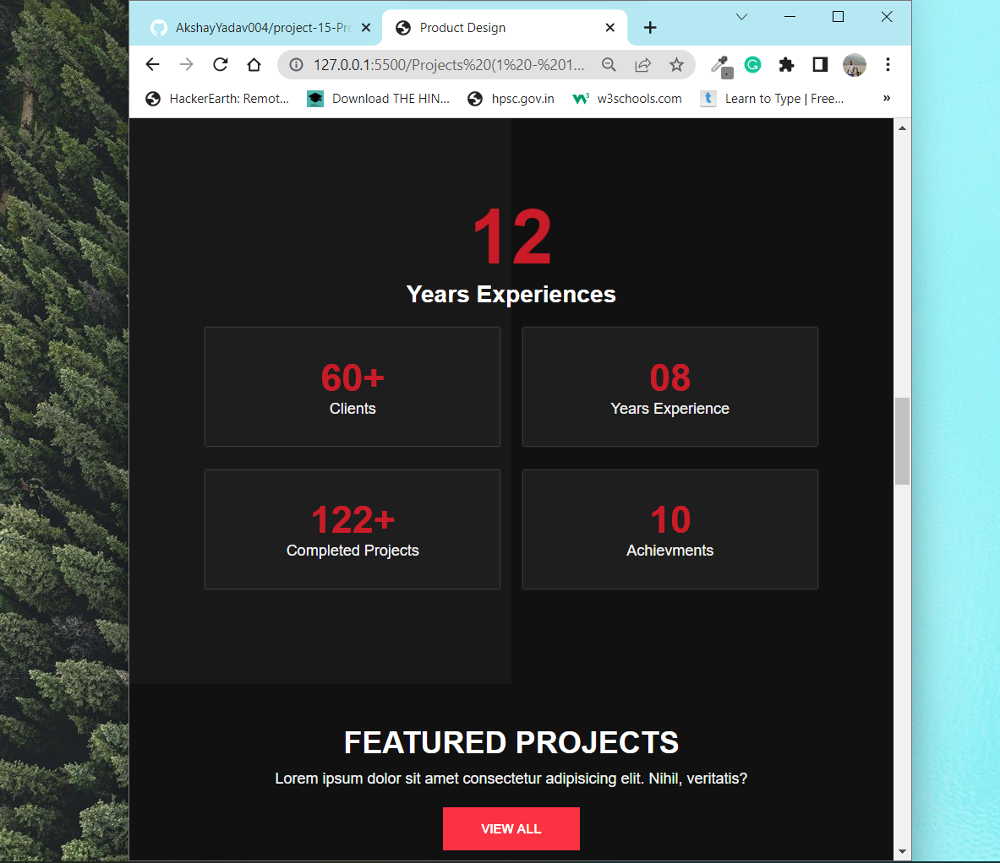

# Project - 15: Product Design page

Languages used :
 * HTML
 * CSS
 
 To look better I used transitions and hover effects. 
 By working on this project I applied theroritical knowledge of grid and flex box.
 * Used media queries to make the page responsive.  

### Link to web page : [Deploy link](https://product-design-landing-webpage-15.netlify.app/)

> ## Below are the screen-shots of how the web page look like

>## As shown in the image the when hover over the section the effect is visible.

> ## When hover over the porject a box shadow appears and the image of project also zooms a little bit.

## Images of the responsive web-page

